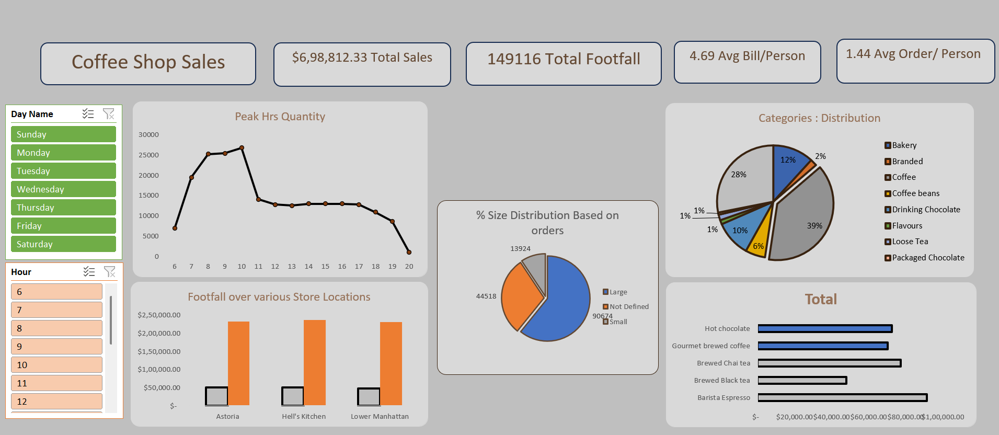

# Coffee Shop Sales & Operations Dashboard

## Project Overview
This project features an exploratory data analysis (EDA) and visualization dashboard focused on the retail operations of a high-volume coffee shop franchise. By analyzing transaction-level data, this project tracks key performance indicators (KPIs) surrounding revenue velocity, peak operational hours, geographic store performance, and consumer product preferences to help management drive revenue growth and optimize staffing.

## Live Visuals

---

## Operational Business Insights Delivered
* **Peak Foot Traffic Analysis:** Isolated exact hourly sales spikes (e.g., morning rush hour vs. afternoon lulls) to provide data-driven recommendations for staff scheduling.
* **Product Mix & Sizing Velocity:** Analyzed sales volumes across beverage categories (Coffee, Tea, Bakery, etc.) and size variations to determine which products drive the highest inventory turnover.
* **Revenue Drivers:** Tracked average order value (AOV) and total transaction counts across different store locations to isolate top-performing retail units.
* **Sales Elasticity & Trends:** Modeled daily and monthly sales momentum to understand the impacts of weekday morning rushes versus weekend consumer behaviors.

---

## Technical Stack & Skills Demonstrated
* **Data Sanitization:** Cleared out transactional anomalies, formatted timestamps into distinct hourly buckets, and unified pricing data types.
* **Advanced Aggregations:** Leveraged analytical functions and pivot structures to isolate sales metrics by day-of-week, hour-of-day, and product category.
* **Data Presentation:** Built a clean, intuitive visual layout utilizing cohesive color themes, prominent KPI blocks for high-level health metrics, and synchronized filtering capabilities.

---

## How to Run the Analysis
1. Clone or download this repository to your local machine.
2. Open the main project file using Microsoft Excel / Power BI.
3. Use the interactive slicers to filter sales metrics by specific store locations or product categories to view real-time shifts in operational data.
